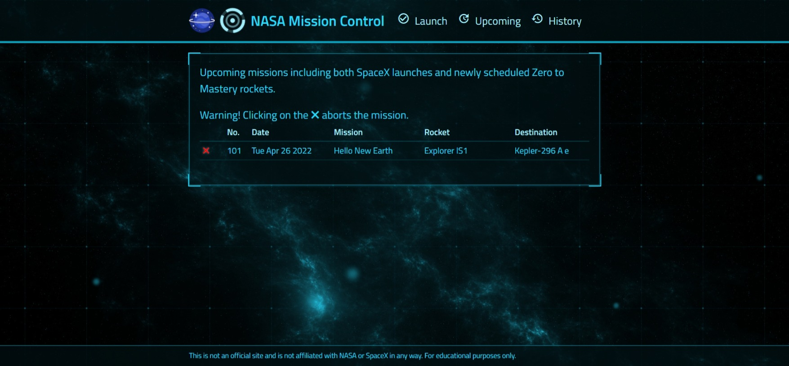

# NASA Project

  

  

  Architecture Diagram

## What is NASA Project

Schedule a mission launch for interstellar travel to one of the Kepler Exoplanets.
Only confirmed planets matching the following criteria are available for the earliest scheduled missions: 

- Planetary radius < 1.6 times Earth's radius
- Effective stellar flux > 0.36 times Earth's value and < 1.11 times Earth's value
   

## Frontend framework

- React.Js
- [Arwes](https://arwes.dev)

## Backend framework

- NodeJS
- ExpressJS

## Testing framework

- Jest
- Supertest

## Data example

- [kepler_data.csv](https://exoplanetarchive.ipac.caltech.edu/cgi-bin/TblView/nph-tblView?app=ExoTbls&config=cumulative)

## All pages

### Launch Screen

Schedule a mission launch for interstellar travel to one of the Kepler Exoplanets.

### Upcoming Screen

Upcoming missions including both SpaceX launches and newly scheduled Zero to Mastery rockets.

### History Screen

History of mission launches including SpaceX launches starting from the year 2006.

